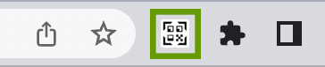
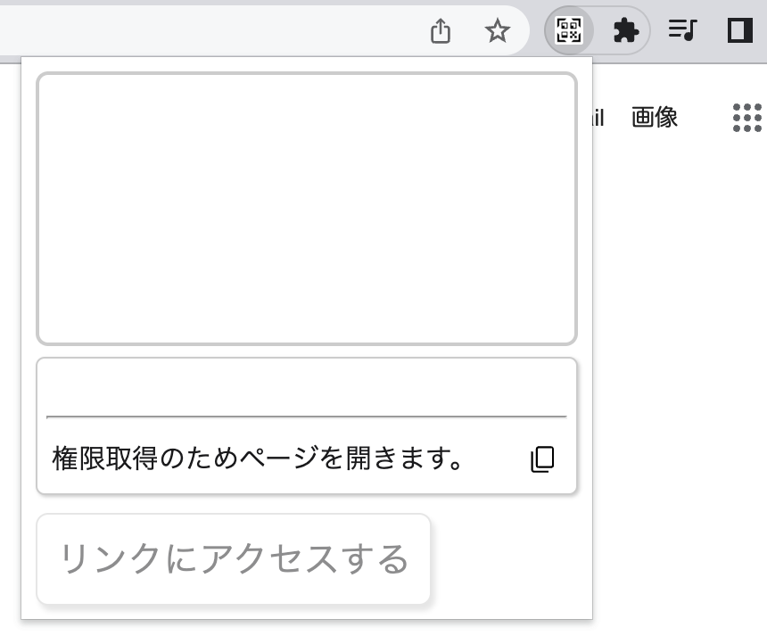
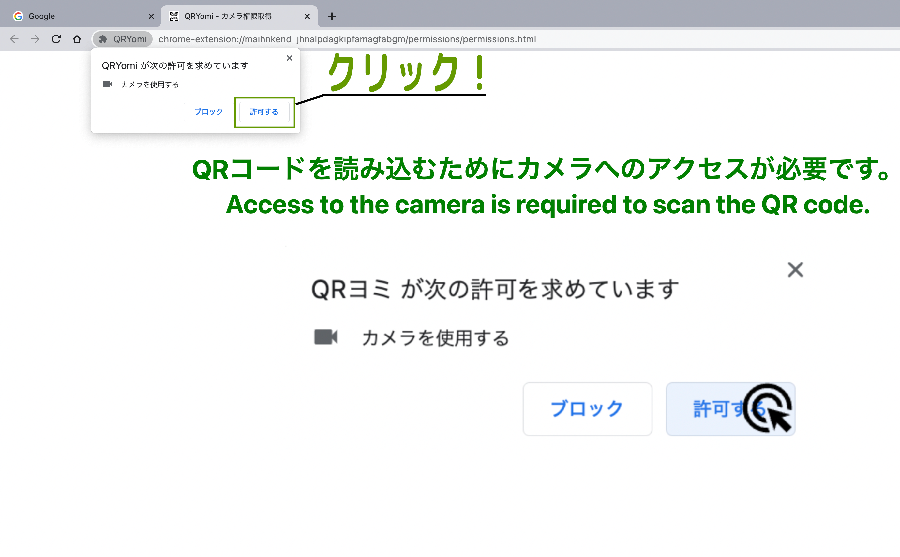
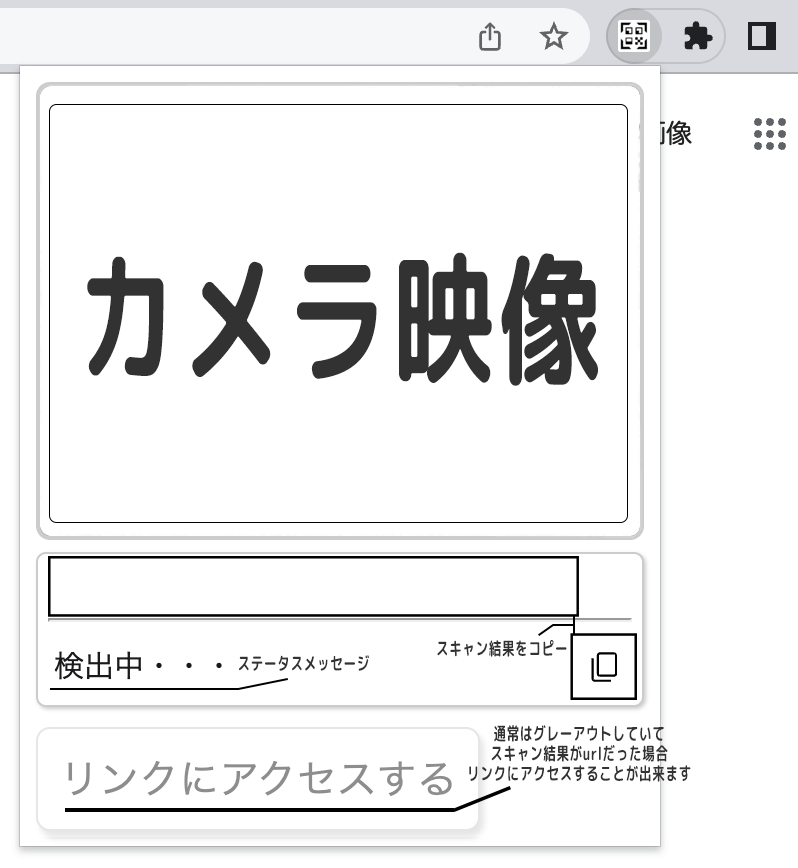

<h1>
    

  QRYomi: QR code reader extension
</h1>

  
[日本語の README はこちら](./README.md)

### About

**As soon as you open it!**
This is a Chrome extension that allows you to read QR codes with your webcam.

## Install

↓Click here  
  
↑Click here

## Example

How to use

1. Go to the [Chrome Web Store](https://chromewebstore.google.com/detail/qryomi/nmanfahnbpmfhoddlchncnoemgoieogp) and click Add to Chrome  
  

1. Click on the QRYomi icon  
  

1. Please wait about 2 seconds as a page will open the first time you access the camera  
  

1. When the page opens, we want you to allow access to the camera, so click on “Allow” in the upper left corner  
  

1. Once you have given your permission, close this page  
  

1. Click the QRYomi button again to start scanning the QR code  
  

Example of text detection  

Example of url detection  

## PrivacyPolicy

Please read the QRYomi [PrivacyPolicy](./docs/PrivacyPolicy-en.md)

## Features that may be added

- add Settings page
- i18n ← now!
- QR Code detection from image files
- Detects QR codes from within a page
- Create a QR Code

## Contact

- name: MizuYaYa
- twitter: [@miraisan64](https://twitter.com/miraisan64)
- E-mail address: <miraisan.mizuyaya+info@gmail.com>
- Contact Form: [https://forms.gle/bwUek7LVhxXNByjA9](https://forms.gle/bwUek7LVhxXNByjA9)

## OSS

- Apache License 2.0
  - [jsQR](https://github.com/cozmo/jsQR)

## License

QRYomi is licensed under the [Apache License 2.0](http://www.apache.org/licenses/LICENSE-2.0).

Copyright 2022 MizuYaYa

Licensed under the Apache License, Version 2.0 (the "License");
you may not use this file except in compliance with the License.
You may obtain a copy of the License at

    http://www.apache.org/licenses/LICENSE-2.0

Unless required by applicable law or agreed to in writing, software
distributed under the License is distributed on an "AS IS" BASIS,
WITHOUT WARRANTIES OR CONDITIONS OF ANY KIND, either express or implied.
See the License for the specific language governing permissions and
limitations under the License.
