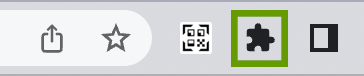

# QRYomi: QRコード読み取り拡張機能

[English README is here](./README-en.md)

## 概要
**開いたらすぐ！**
QRコードをwebカメラで読み取ることができるChromeの拡張機能です。

読み方は「QRYomi(くるよみ)」ですよ！！！！

## プライバシーポリシー
[QRYomiのプライバシーポリシー](https://mizuyaya.github.io/QRYomi/PrivacyPolicy)を最初にお読みください

## インストール

### 説明
表示する画面はこれだけ！
シンプルだから動作が軽いです。
1. カメラ映像
2. 検出した内容
3. 検出した内容をコピーするボタン
4. 表示されるステータスメッセージ
   - 通常時に表示されるメッセージ
     - カメラを起動中です・・・
     - 検出中・・・
   - 初回起動時に表示されるメッセージ
     - 権限取得のためページを開きます。
   - 検出した時のメッセージ
     - リンクを検出しました。
     - httpのリンクを検出しました。
     - テキストを検出しました。
   - エラーメッセージ
     - カメラにアクセスできません 
     - カメラの権限がありません。chrome側のサイトの設定からカメラの権限を許可してください。
     - 予期せぬエラーが発生した可能性があります。[エラー内容]
5. リンクを検出した際に直接アクセスするボタン
6. 検出した際にもう一度検出する用のボタン

## 使い方
1. 上のボタンから Web Store に行ってChromeに追加する
   <!-- リリース後「Chromeに追加する」スクショを追加 -->
2. 右上の拡張機能のボタンを押してQRYomiをピン留めする
   
   
   
3. QRYomiのボタンをクリックします。
   
   
4. 最初だけ権限取得のためのページを開くので2秒ほどお待ちください。
   
   
5. カメラアクセスの権限が必要なので左上にある「許可する」をクリックしてください
   
   
6. 許可をしたらこのページは閉じてください
   
   
7. もう一度QRYomiのボタンをクリックするとQRコードのスキャンが開始されます。
   
   
### 使用例
テキストを検出した例

 

urlを検出した例

## 今後追加が予定される機能
- 設定項目の追加
- 多言語化
- 画像ファイルからの読み込み
- 閲覧しているページ内のQRコードを検出
- QRコードを作成

## 開発者
- 名前：MizuYaYa
- twitter：[@miraisan64](https://twitter.com/miraisan64)
- 連絡先：miraisan.mizuyaya+info@gmail.com
- お問い合わせフォーム：[https://forms.gle/bwUek7LVhxXNByjA9](https://forms.gle/bwUek7LVhxXNByjA9)

## OSS
- Apache License 2.0
  - [jsQR](https://github.com/cozmo/jsQR)

## ライセンス
QRYomiは[Apache License 2.0](http://www.apache.org/licenses/LICENSE-2.0)で提供されています。

Copyright 2022 MizuYaYa

Licensed under the Apache License, Version 2.0 (the "License");
you may not use this file except in compliance with the License.
You may obtain a copy of the License at

    http://www.apache.org/licenses/LICENSE-2.0

Unless required by applicable law or agreed to in writing, software
distributed under the License is distributed on an "AS IS" BASIS,
WITHOUT WARRANTIES OR CONDITIONS OF ANY KIND, either express or implied.
See the License for the specific language governing permissions and
limitations under the License.
